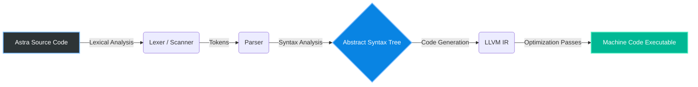

## About Astra
Astra is a statically-typed programming language currently in development. The project features a custom-built frontend (lexer and parser) written entirely in C++, which constructs an Abstract Syntax Tree (AST) and integrates with an LLVM backend for intermediate representation (IR) and code generation.

## Current Architecture
* **Frontend:** Custom Lexical Analysis and Parsing (C++)
* **Core:** Abstract Syntax Tree (AST) Generation
* **Backend:** LLVM Infrastructure Integration

**Author:** Smit S Kamatnurkar

## The Astra Compilation Pipeline

Astra processes source code through a custom-built frontend before handing it off to the LLVM infrastructure for heavy-duty optimization and machine-code generation.



## Design Philosophy

Astra is built with a strict focus on low-level system performance and minimal abstraction. Rather than relying heavily on bloated standard libraries or external framework crutches, the core compiler infrastructure—including the lexer and parser—prioritizes manual algorithmic implementation and rigorous memory management in C++ to maintain absolute control over the execution flow before reaching the LLVM backend.

## A Taste of Astra

Here is what writing in Astra looks like:

```cpp
// Example: Calculating a factorial in Astra
fn factorial(n: int) -> int {
    if (n == 0) {
        return 1;
    }
    return n * factorial(n - 1);
}

let result: int = factorial(5);
print(result); // Outputs 120
```

## How to Build

Astra uses CMake and requires LLVM to be installed on your system.

```bash
# Clone the repository
git clone [https://github.com/Smit-Kamatnurkar/Astra.git](https://github.com/Smit-Kamatnurkar/Astra.git)
cd Astra

# Create a build directory
mkdir build
cd build

# Generate Makefiles and compile
cmake ..
make

# Run the compiler (example usage)
./astra
```
